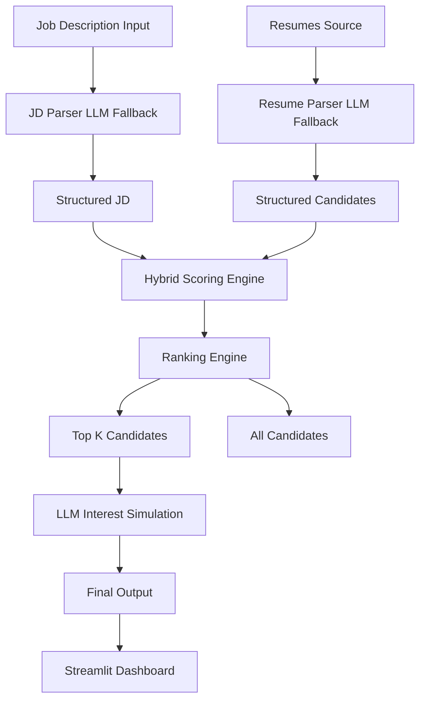
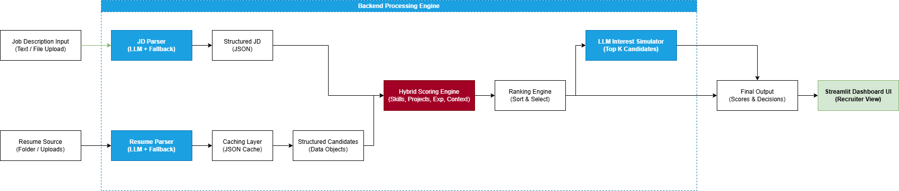

# 🚀 AI Talent Scouting Agent

[](https://www.python.org)
[](https://opensource.org/licenses/MIT)
[](https://github.com/piyushjha/ai-talent-agent/stargazers)
[](https://github.com/piyushjha/ai-talent-agent/network)

An **AI-powered candidate screening and ranking system** that automates resume parsing, job description understanding, and candidate shortlisting using **LLMs + hybrid scoring (rules + embeddings)**.

---

## 🧠 Overview

Recruiters often spend hours manually reviewing resumes. This system automates that process by:

- Parsing **Job Descriptions (JD)**
- Extracting structured data from **resumes**
- Scoring candidates using a **hybrid AI system**
- Ranking and shortlisting candidates
- Simulating candidate interest using an LLM

---

## 🏗️ Architecture Diagram

> GitHub supports Mermaid. If it doesn't render on your viewer, it will still show as code.



---


## 🏗️ Architecture Diagram 2.0 

> Just incase Mermaid fails in your system.
<p align="center">
  
</p>

---

## ⚙️ Key Features

- 📄 JD Parsing (LLM-powered + fallback)
- 📑 Resume Parsing (LLM + rule-based fallback)
- 🧠 Hybrid Scoring System
- ⚡ Caching for faster performance
- 🎯 Top-K candidate shortlisting
- 🤖 LLM-based candidate interest simulation
- 📊 Streamlit recruiter dashboard

---

## 🧮 Scoring System (Core Logic)

This project uses a Hybrid Scoring System, combining rule-based logic with semantic understanding.

### 1️⃣ Skill Score (50%) — Precision First

- Exact match
- Synonym matching
- Fuzzy matching

**Why?**
Skills require precision. Pure embeddings can introduce false positives.

### 2️⃣ Project Score (20%) — Embedding-Based

Uses SentenceTransformers. Compares:
- Candidate projects ↔ JD requirements

**Why?**
Projects represent real-world ability, not just listed skills.

### 3️⃣ Experience Score (20%)

Rule-based:
- Within range → full score
- Below → scaled score
- Above → slight penalty

**Why?**
Structured data doesn't need AI.

### 4️⃣ Context Score (10%) — Embedding-Based

Compares:
- Candidate bio + skills ↔ JD summary

**Why?**
Captures overall alignment beyond keywords.

### 🔢 Final Score Formula

```
Final Score =
0.5 × Skill Score +
0.2 × Project Score +
0.2 × Experience Score +
0.1 × Context Score
```

---

## 🤖 LLM Usage Strategy

LLMs are used strategically to reduce cost and latency:

| Task | LLM Used? |
|------|-----------|
| JD Parsing | ✅ |
| Resume Parsing | ✅ |
| Scoring | ❌ |
| Interest Simulation | ✅ (Top K only) |

---

## ⚡ Caching System

- **File:** resumes_cache.json
- **How it works:**
  - First run: Resume → LLM parsing → cached
  - Next runs: Load from cache (no API call)
- **Benefits:**
  - ⚡ Faster execution
  - 💰 Lower API cost
  - 🔒 Stable outputs

---

## 🧰 Tech Stack

| Component | Technology |
|-----------|------------|
| Backend | FastAPI |
| Frontend | Streamlit |
| LLM | Gemini (Google GenAI) |
| Embeddings | SentenceTransformers |
| Parsing | PDF / DOCX |
| Language | Python |

---

## 📦 Project Structure

```
ai-talent-agent/
├── app/
│   ├── agent.py
│   ├── scorer.py
│   ├── jd_parser.py
│   ├── resume_parser.py
│   ├── utils.py
│   └── main.py
├── resumes/
├── UI.py
├── resumes_cache.json
├── requirements.txt
└── README.md
```

---

## ▶️ How to Run Locally

### 1️⃣ Clone the repo

```bash
git clone https://github.com/YOUR_USERNAME/ai-talent-agent.git
cd ai-talent-agent
```

### 2️⃣ Create virtual environment

```bash
python -m venv venv
source venv/bin/activate   # Mac/Linux
venv\Scripts\activate      # Windows
```

### 3️⃣ Install dependencies

```bash
pip install -r requirements.txt
```

### 4️⃣ Add API key

Create `.env` file:

```
GOOGLE_API_KEY=your_api_key_here
```

### 5️⃣ Start backend

```bash
uvicorn app.main:app --reload
```

### 6️⃣ Run UI

```bash
streamlit run UI.py
```

---

## 🧪 Sample Job Description (Test Input)

**Role:** AI/ML Engineer (0–2 years)

We are looking for a passionate AI/ML Engineer with strong Python skills.

**Required Skills:**
- Python
- Machine Learning
- Pandas, NumPy
- FastAPI or Flask
- SQL

**Preferred Skills:**
- Docker
- AWS/GCP
- NLP or Deep Learning

**Experience:**
0–2 years

---

## 📊 Output

- Ranked candidates
- Match Score
- Interest Score
- Final Score
- **Decision:**
  - Strong Shortlist
  - Shortlist
  - Consider
  - Reject

---

## 🚀 Future Improvements

- 🔍 Vector DB integration (semantic search)
- ☁️ Cloud resume storage (S3)
- 🧠 Fine-tuned embeddings
- 📈 Feedback learning loop
- 🏢 Multi-role JD optimization

---

## 🎯 Why This Project Matters

This project demonstrates:

- Real-world AI system design
- Cost-optimized LLM pipelines
- Hybrid ML + rule-based architecture
- End-to-end pipeline (UI + API + ML)

---

## 👨‍💻 Author

**Piyush Jha**  
AI/ML Engineer | Data Science @ IIT Madras